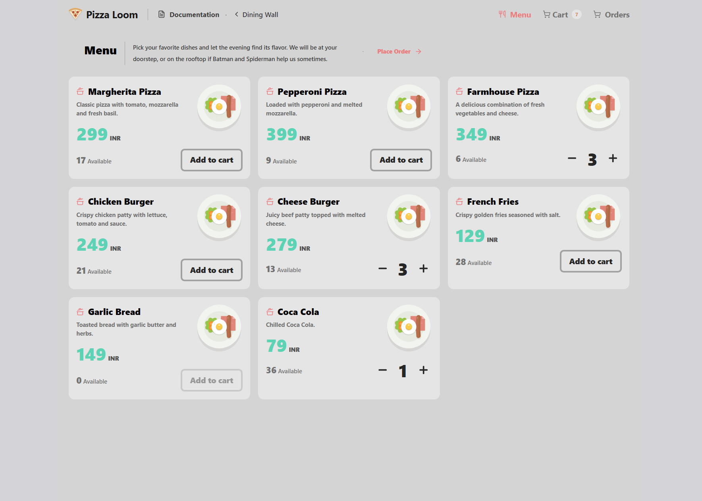
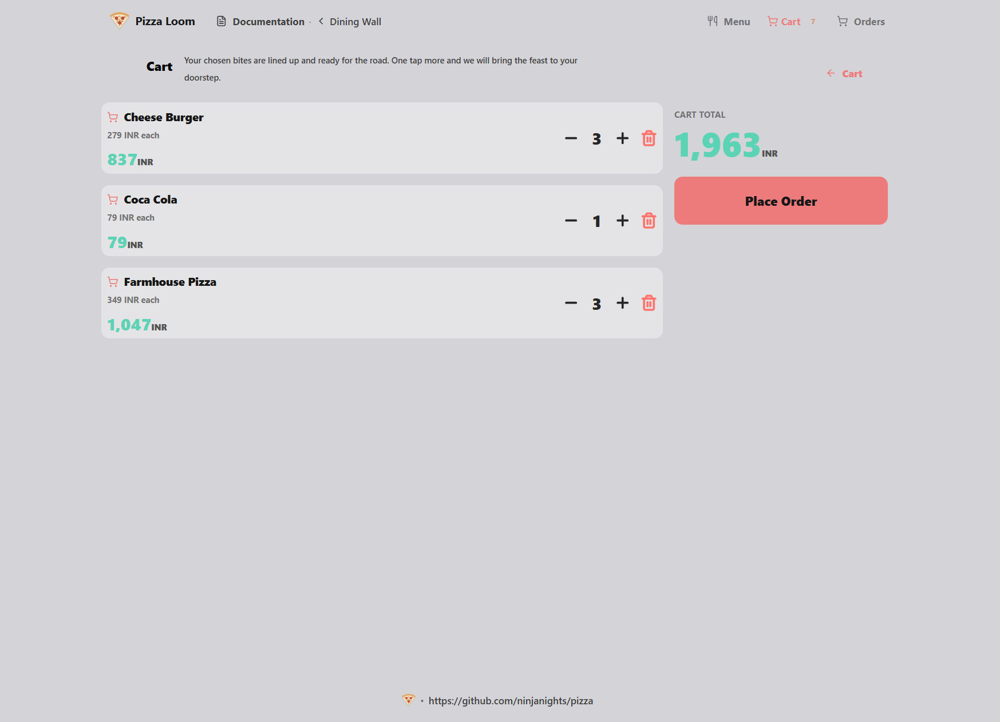
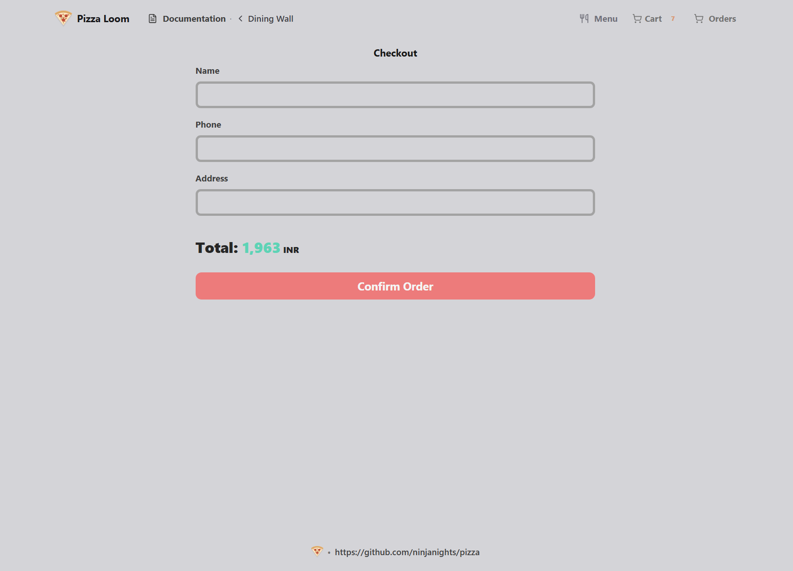
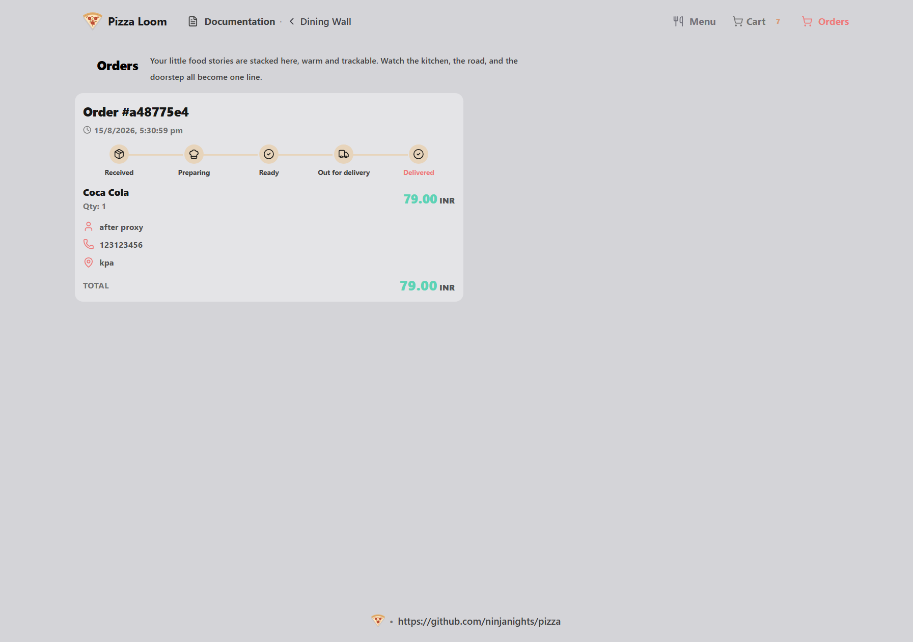
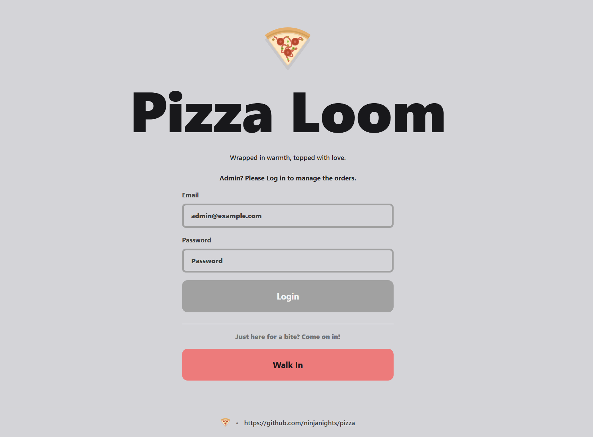
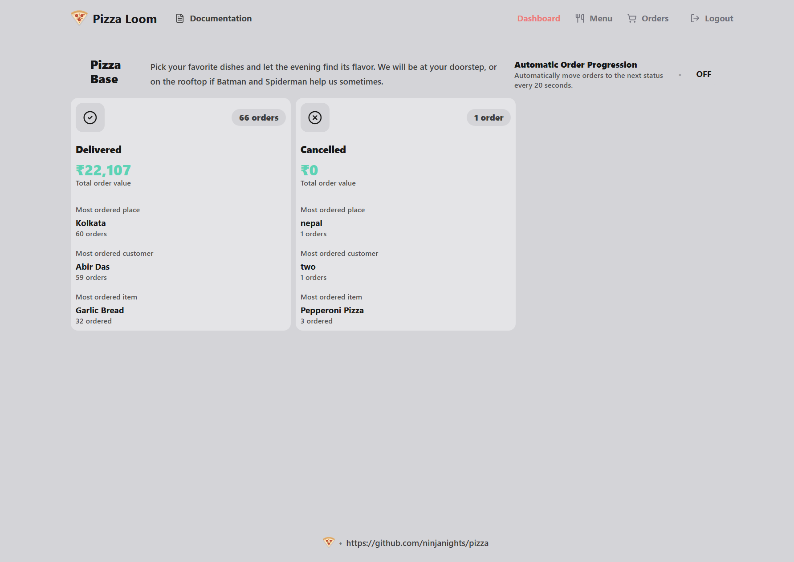
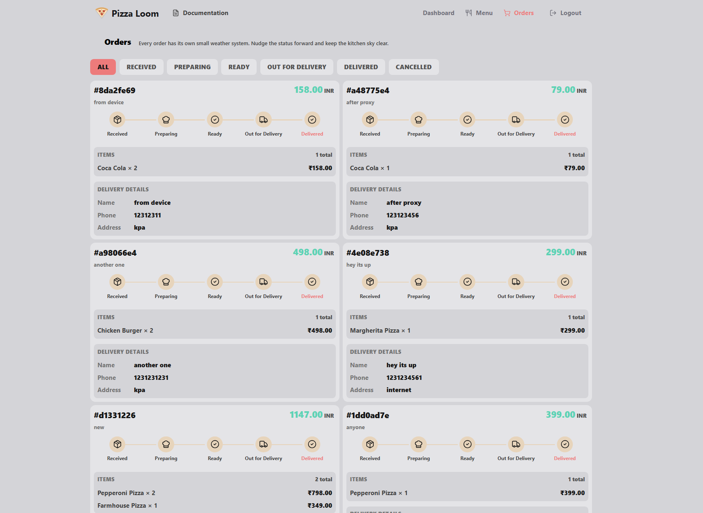
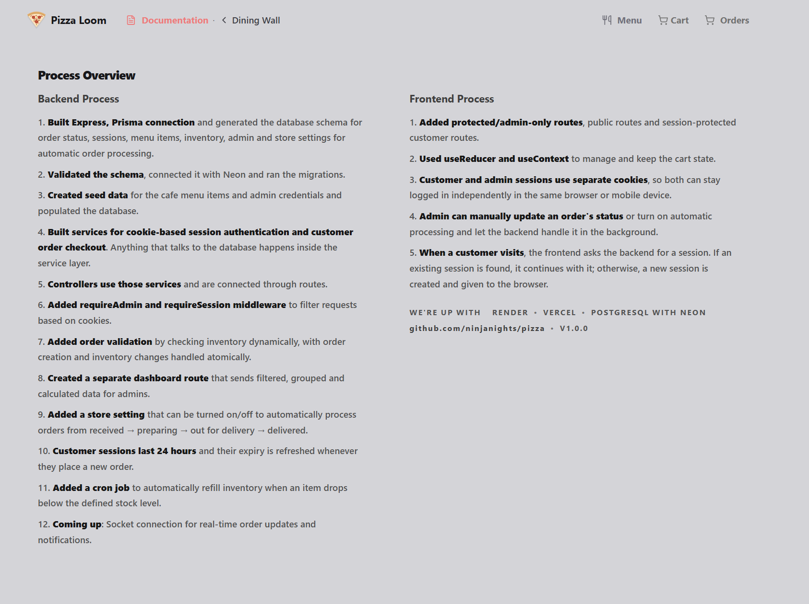

Pizza Loom

A full-stack cafe ordering system built to handle customer ordering, session-based checkout, admin order management, inventory, and automatic order processing.

# Key Features 
Session-based customer ordering with HTTP-only cookies
Admin authentication with protected routes
Cart management with React Context + useReducer
Dynamic inventory validation during checkout
Atomic order + inventory transactions
Admin dashboard with order statistics
Manual order status management
Automatic order progression from the backend
24-hour customer sessions with expiry refresh
Neon PostgreSQL database
Production deployment with Vercel + Render

# Tech Stack
Frontend: React, TypeScript, React Router, Tailwind CSS, Context API

Backend: Node.js, Express.js, TypeScript, Prisma

Database: PostgreSQL, Neon

Authentication: JWT, bcrypt, HTTP-only cookies

Deployment: Vercel, Render

# Development Process
Built the Express + Prisma backend and designed the database schema for orders, sessions, menu items, inventory, admins, and store settings.
Connected Prisma with Neon, validated the schema, ran migrations, created seed data, and populated the database with cafe items and admin credentials.
Built the service layer for database operations, controllers and routes, session/admin middleware, transactional order validation, dashboard APIs, automatic order processing, and inventory automation.

# Frontend Process
Created public, customer-session, and admin-protected routes.
Built cart management using useContext and useReducer, with customer sessions handled through HTTP-only cookies.
Connected the frontend to the backend for ordering, inventory validation, admin management, dashboard data, and automatic order progression.

# Next
Real-time order updates and notifications using Socket.IO, so customers and admins can receive status changes without refreshing the page.

We're live at https://pizzaloom.vercel.app/

# Screenshots

